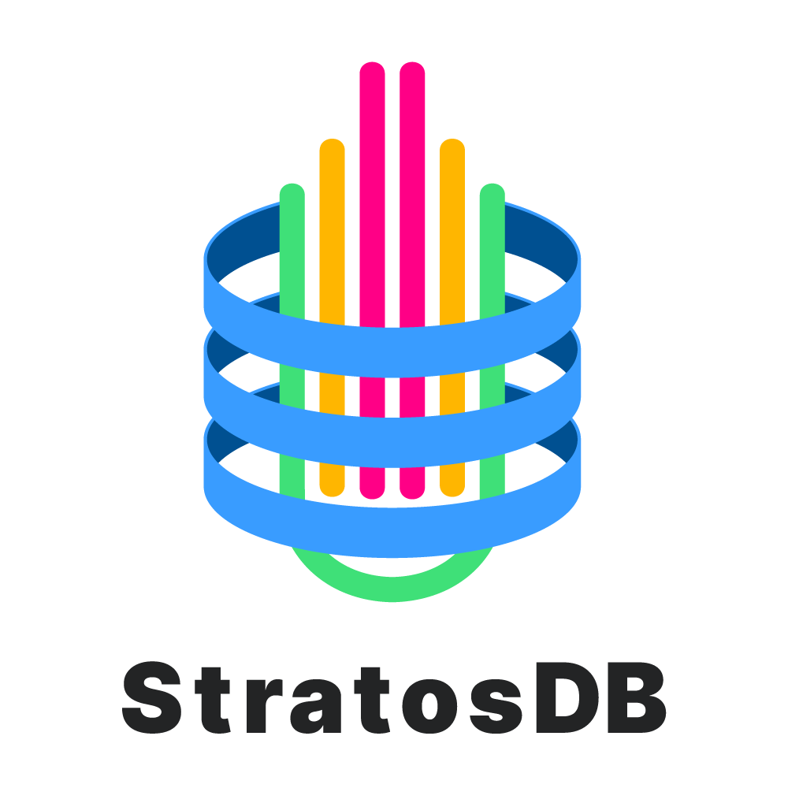
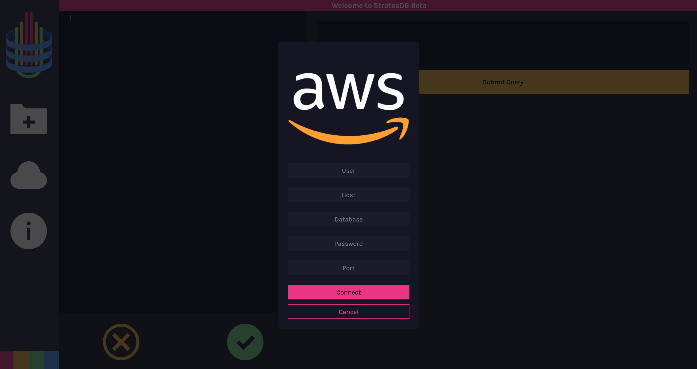
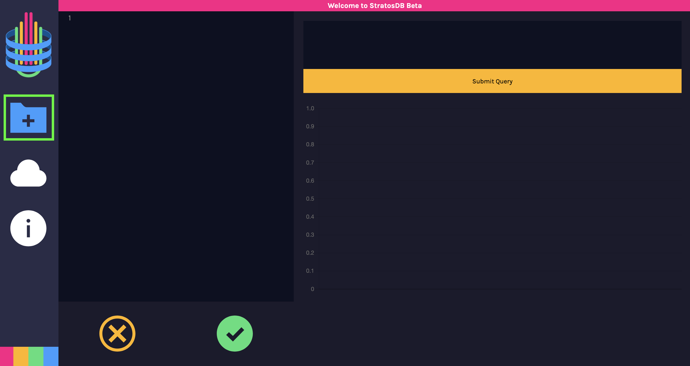
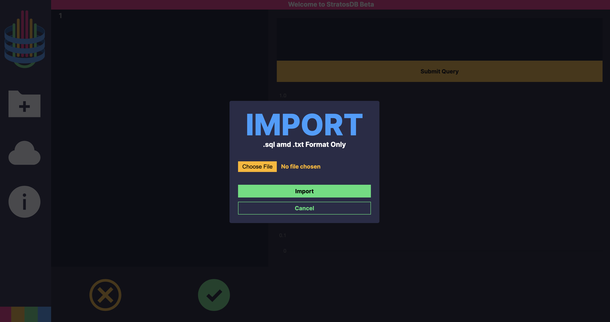
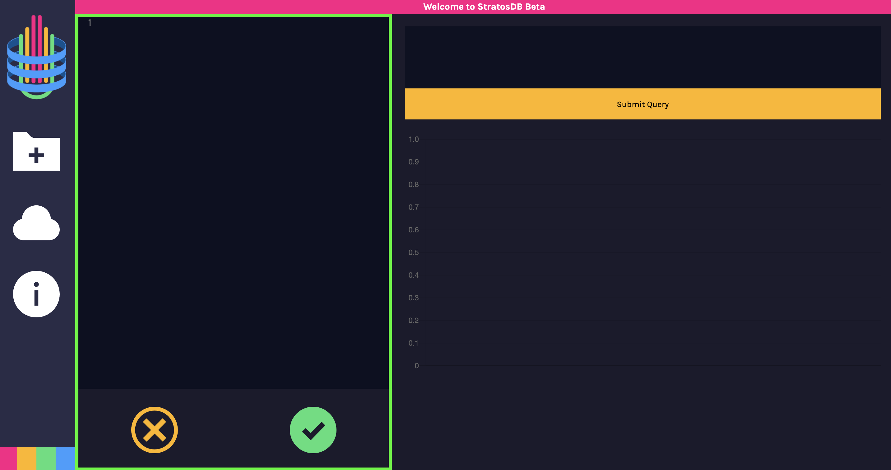
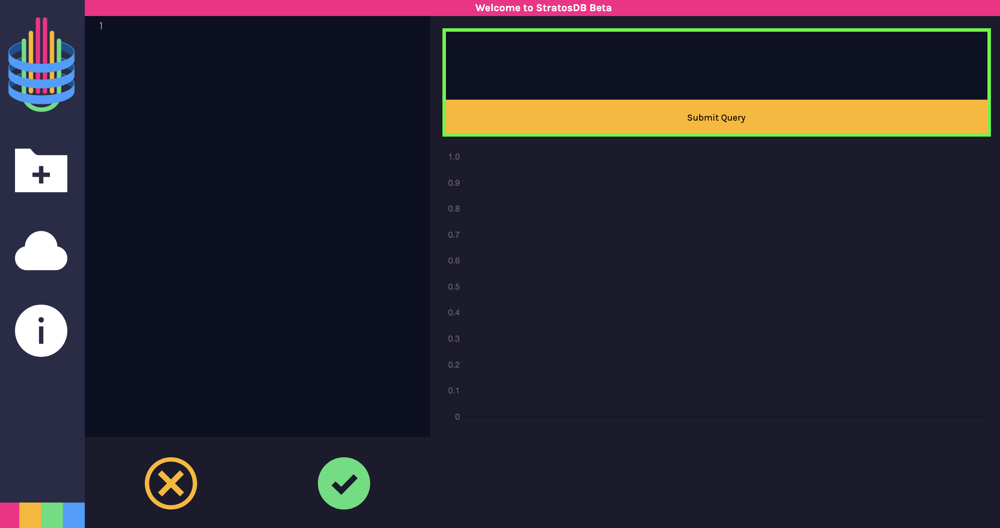
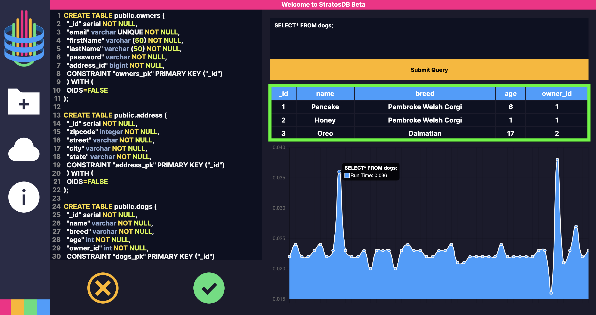
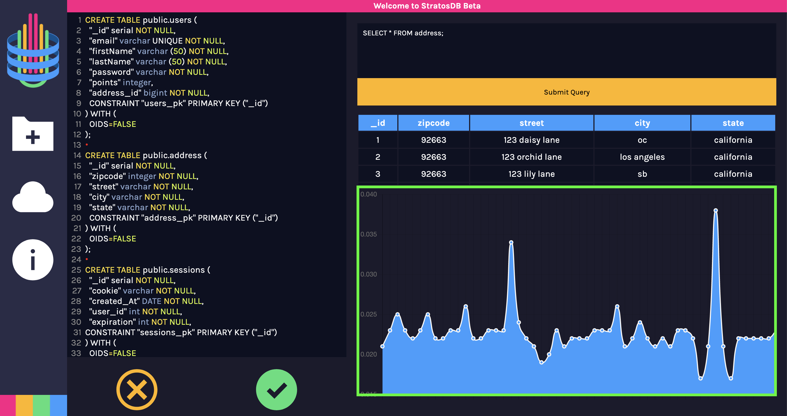

 

 

<a href="https://stratosdb.io">stratosDB.io</a>

 

 

<b>stratosDB: </b>A Cloud SQL database performance tester and deployment tool

 

## Table of Contents

- <a href="https://github.com/oslabs-beta/StratosDB#beta-stage">Beta Stage</a>
- <a href="https://github.com/oslabs-beta/StratosDB#getting-started">Getting Started</a>
- <a href="https://github.com/oslabs-beta/StratosDB#main-features">Main Features</a>
- <a href="https://github.com/oslabs-beta/StratosDB#built-with">Built With</a>
- <a href="https://github.com/oslabs-beta/StratosDB#core-team">Core Team</a>
- <a href="https://github.com/oslabs-beta/StratosDB#license">License</a>

 

## Beta Stage

Team StratosDB will strive to continuously release updates and additional features.

1. If you would like to contribute to this project:

   - Please feel free to submit a PR

2. If you happen to come across any issues while tinkering with the application:
   - Please report the bug/issue by submitting a ticket located in the Issues Tab within this repository

 

## Overview

 

## Getting Started

1.  Clone StratosDB to your local machine and point to the StratosDB directory:

        git clone https://github.com/oslabs-beta/StratosDB.git

        cd StratosDB

2.  Install all required dependencies with the following script:

        npm install

3.  Run the following script to open StratosDB on http://localhost:8080:

        npm run beta

4.  Once StratosDB is opened on http://localhost:8080, click on the Cloud Icon (located on the Left Sidebar)

	

5.  Enter your AWS RDS Information and press <strong>Connect</strong>

    <strong>User:</strong> Database Username
     
    <strong>Host:</strong> AWS RDS Endpoint Link \*
     
    <strong>Database:</strong> Database name \*\*
     
    <strong>Password:</strong> Database Password

	

\* Sourced from AWS RDS Database Instance Dashboard

\*\* If Database name was left blank when the AWS RDS Datbase Instance was created, use <strong>postgres</strong>

 

## Main Features

### IMPORTING .SQL AND .TXT FILES

1.  Click on the Import Icon (located on the Left Sidebar)
2.  Choose the .SQL or .TXT file you would like to import
3.  Select <strong>Import</strong> to populate your file's code base into the application's built-in code editor.

	

### SCHEMA CODE EDITOR

Use the Schema Code Editor to input any psql command queries (EG. <strong>CREATE TABLE</strong>, <strong>INSERT INTO</strong>, <strong>DROP TABLE</strong>) to create/read/update/delete tables
and/or data entries from your tethered AWS RDS database

	

### QUERY TEXT EDITOR

Enter your <strong>SELECT</strong> psql commands into the provided
text editor and press <strong>Submit Query</strong> to initiate the
performance analysis on your existing schema design

EG. SELECT \* FROM <em>TABLE_NAME</em>;

### RETURN TABLE

A scrollable table will render based on the <strong>SELECT</strong> query you have entered in the <strong>Query Text Editor</strong>

### VISUAL LINE GRAPH

A visual line graph representation will render the performance time
(milliseconds) for each successfully performed <strong>SELECT</strong> query \*\*

	

\*\* You can hover over each point in the line graph to view the query
that was ran and the performance time (ms)

 

## Built With

- React
- TypeScript
- CodeMirror
- React-ChartJS-2
- Node.JS
  - Express
- AWS RDS
  - PostgreSQL

 

## Core Team

<table>
<tr>
<td>

 
<a href="https://github.com/joalk">Joal Kim</a>
</td>
<td >

 
<a href="https://github.com/sophiapak">Sophia Pak</a>
</td>
<td>

 
<a href="https://github.com/tysong24">Tommy Song</a>
</td>
<td>

 
<a href="https://github.com/morgan562">Tyler Morgan</a>
</td>
</tr>
</table>

 

## License

This project is licensed under the MIT License
